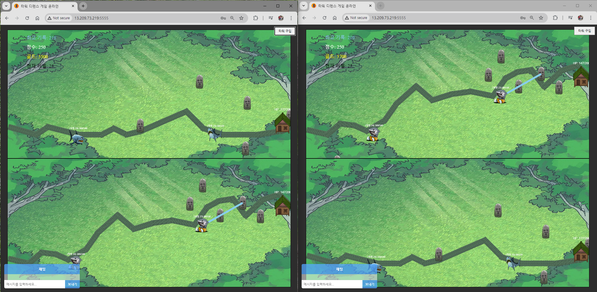
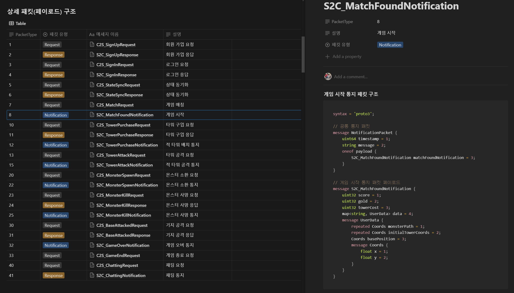

## 타워 디펜스 게임 프로젝트



프로젝트 제작 기간 : 2024.7.11.(목) ~ 2024.7.18.(목)

### 타워 디펜스 게임 프로젝트 기획 및 설계

- 🧾 [프로젝트 기획 및 설계 회의록](https://eliotjang.notion.site/eb4a19d5c3c74f27b83270d6653712a4?pvs=4)
- 🛠 [깃허브 규칙](https://eliotjang.notion.site/e7dd48c709964ffeaaa4225901ccf5ec?pvs=4)
- ⚙ [코드 컨벤션](https://eliotjang.notion.site/1f3ad11a7cdb4c2080e2268ff2f93091?pvs=4)
- 📖 [프로젝트 포트폴리오](https://docs.google.com/presentation/d/1mUflLyZjI3Abh4CpwkEGvtWRp88foeMTvpbPQgY16Wk/edit#slide=id.g2eca54a905f_28_37)
- 🎬 [프로젝트 시연영상](https://www.youtube.com/watch?v=l66w7czfeWg)

### 프로젝트 패킷 명세서



- [프로젝트 패킷 명세서 링크](https://www.notion.so/2fed892d7d3a4fde9e6423cd13afd820)

### Redis 데이터 & 데이터 테이블

- 📊 [Redis 데이터 & 데이터 테이블 링크](https://eliotjang.notion.site/Redis-acfa00b6d8b1466ea124f76bc33ec525)

### 스킬 스택


### 폴더 구조

```plaintext
📦assets
 ┗ 📜game.json

📦public
 ┣ 📂images
 ┃ ┣ 📜base.png
 ┃ ┣ 📜bg.webp
 ┃ ┣ 📜favicon.ico
 ┃ ┣ 📜game.png
 ┃ ┣ 📜logo.png
 ┃ ┣ 📜monster1.png
 ┃ ┣ 📜monster2.png
 ┃ ┣ 📜monster3.png
 ┃ ┣ 📜monster4.png
 ┃ ┣ 📜monster5.png
 ┃ ┣ 📜packet-structure.png
 ┃ ┣ 📜path.png
 ┃ ┗ 📜tower.png
 ┣ 📂sounds
 ┃ ┣ 📜attacked.wav
 ┃ ┣ 📜bgm.mp3
 ┃ ┣ 📜lose.wav
 ┃ ┗ 📜win.wav
 ┣ 📂src
 ┃ ┣ 📂auth
 ┃ ┃ ┗ 📜token.auth.js
 ┃ ┣ 📂constants
 ┃ ┃ ┣ 📜constants.js
 ┃ ┃ ┣ 📜packet-types.constants.js
 ┃ ┃ ┗ 📜proto.constants.js
 ┃ ┣ 📂css
 ┃ ┃ ┗ 📜mystyle.css
 ┃ ┣ 📂events
 ┃ ┃ ┗ 📜on-event.event.js
 ┃ ┣ 📂handlers
 ┃ ┃ ┣ 📜base.handler.js
 ┃ ┃ ┣ 📜chatting.handler.js
 ┃ ┃ ┣ 📜game-over.handler.js
 ┃ ┃ ┣ 📜index.handler.js
 ┃ ┃ ┣ 📜match-found.handler.js
 ┃ ┃ ┣ 📜monster-kill.handler.js
 ┃ ┃ ┣ 📜monster-spawn.handler.js
 ┃ ┃ ┣ 📜sign-in.handler.js
 ┃ ┃ ┣ 📜sign-up.handler.js
 ┃ ┃ ┣ 📜state-sync.handler.js
 ┃ ┃ ┣ 📜tower-attack.handler.js
 ┃ ┃ ┗ 📜tower.handler.js
 ┃ ┣ 📂init
 ┃ ┃ ┣ 📜game-loader.init.js
 ┃ ┃ ┣ 📜index.init.js
 ┃ ┃ ┗ 📜init.js
 ┃ ┣ 📂interval
 ┃ ┃ ┗ 📜stateSyncLoop.js
 ┃ ┣ 📂modals
 ┃ ┃ ┗ 📜modal.js
 ┃ ┣ 📂protobuf
 ┃ ┃ ┣ 📂classes
 ┃ ┃ ┃ ┗ 📜request.proto.js
 ┃ ┃ ┣ 📜load-proto.js
 ┃ ┃ ┣ 📜notifications.proto
 ┃ ┃ ┣ 📜requests.proto
 ┃ ┃ ┗ 📜responses.proto
 ┃ ┣ 📂utils
 ┃ ┃ ┣ 📂errors
 ┃ ┃ ┃ ┣ 📜customError.js
 ┃ ┃ ┃ ┣ 📜errorCodes.js
 ┃ ┃ ┃ ┗ 📜errorHandler.js
 ┃ ┃ ┣ 📜packet-serializer.js
 ┃ ┃ ┣ 📜toggler.utils.js
 ┃ ┃ ┗ 📜utils.js
 ┃ ┣ 📜base.js
 ┃ ┣ 📜chatting.js
 ┃ ┣ 📜game.js
 ┃ ┣ 📜monster.js
 ┃ ┣ 📜socket.js
 ┃ ┗ 📜tower.js
 ┗ 📜home.html

📦src
 ┣ 📂auth
 ┃ ┗ 📜auth.js
 ┣ 📂config
 ┃ ┗ 📜configs.js
 ┣ 📂constants
 ┃ ┣ 📜case.constants.js
 ┃ ┣ 📜constants.js
 ┃ ┣ 📜env.constants.js
 ┃ ┣ 📜game.constants.js
 ┃ ┣ 📜handler.constants.js
 ┃ ┣ 📜packet-types.constants.js
 ┃ ┣ 📜proto.constants.js
 ┃ ┗ 📜redis.constants.js
 ┣ 📂db
 ┃ ┣ 📂migrations
 ┃ ┃ ┗ 📜createSchemas.js
 ┃ ┣ 📂sql
 ┃ ┃ ┗ 📜user_db.sql
 ┃ ┣ 📂user
 ┃ ┃ ┣ 📜user.db.js
 ┃ ┃ ┗ 📜user.queries.js
 ┃ ┗ 📜database.js
 ┣ 📂events
 ┃ ┣ 📜on-connection.event.js
 ┃ ┣ 📜on-data.event.js
 ┃ ┗ 📜on-disconnect.event.js
 ┣ 📂handlers
 ┃ ┣ 📜base.handler.js
 ┃ ┣ 📜chatting.handler.js
 ┃ ┣ 📜game-end.handler.js
 ┃ ┣ 📜game.handler.js
 ┃ ┣ 📜helper.js
 ┃ ┣ 📜monster.handler.js
 ┃ ┣ 📜sign-in.handler.js
 ┃ ┣ 📜sign-up.handler.js
 ┃ ┣ 📜state-sync.handler.js
 ┃ ┗ 📜tower.handler.js
 ┣ 📂init
 ┃ ┣ 📜assets.js
 ┃ ┣ 📜init.js
 ┃ ┣ 📜proto.init.js
 ┃ ┣ 📜redis.js
 ┃ ┗ 📜socket.js
 ┣ 📂models
 ┃ ┣ 📜game.model.js
 ┃ ┗ 📜user.model.js
 ┣ 📂protobuf
 ┃ ┣ 📂classes
 ┃ ┃ ┣ 📂game
 ┃ ┃ ┃ ┣ 📜game-over.proto.js
 ┃ ┃ ┃ ┗ 📜update-hp.proto.js
 ┃ ┃ ┣ 📂notification
 ┃ ┃ ┃ ┣ 📜match-found.payload.js
 ┃ ┃ ┃ ┗ 📜notification.proto.js
 ┃ ┃ ┗ 📂response
 ┃ ┃ ┃ ┗ 📜response.proto.js
 ┃ ┣ 📜notifications.proto
 ┃ ┣ 📜requests.proto
 ┃ ┗ 📜responses.proto
 ┣ 📂router
 ┃ ┗ 📜accounts.router.js
 ┣ 📂sessions
 ┃ ┣ 📜game.session.js
 ┃ ┗ 📜user.session.js
 ┣ 📂utils
 ┃ ┣ 📂errors
 ┃ ┃ ┣ 📜customError.js
 ┃ ┃ ┣ 📜errorCodes.js
 ┃ ┃ ┗ 📜errorHandler.js
 ┃ ┣ 📜data-remover.utils.js
 ┃ ┣ 📜dateFormatter.js
 ┃ ┣ 📜packet-serializer.utils.js
 ┃ ┣ 📜redis.utils.js
 ┃ ┗ 📜transformCase.js
 ┣ 📜app.js
 ┣ 📜.env
 ┣ 📜.env.example
 ┣ 📜.gitignore
 ┣ 📜.prettierrc
 ┣ 📜package-lock.json
 ┣ 📜package.json
 ┗ 📜README.md
```

### 프로젝트 제작 인원

- 김동균
- 문현후
- 양현언
- 장성원
- 전우찬
